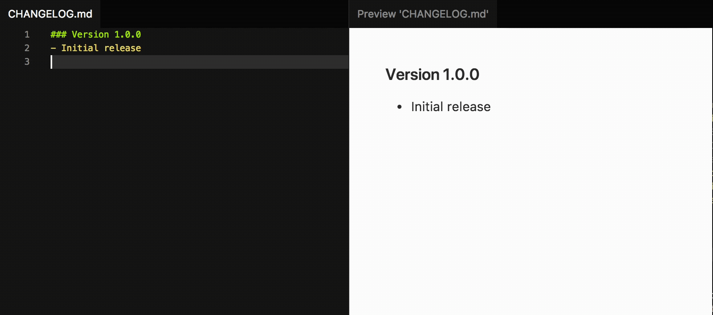

# Bump

<p align="center">
	
</p>

Bump your project's version and update the changelog. Opinionated but configurable.

This extension is here to save you time, this is what it can do for you:
- It can bump your project's version.
- It can detect which commits where made after the latest bump and update your changelog accordingly.
- It can automatically make a commit with the changes made.
- It can execute custom scripts before/after bumping/updating-the-changelog/committing.
- How the changelog gets rendered and the commit message can be customized.

It automatically detects NPM packages, and can be customized to bump the version in whatever file you need it to.

It currently only works with Git projects.

## Install

Follow the instructions in the [Marketplace](https://marketplace.visualstudio.com/items?itemName=fabiospampinato.vscode-bump), or run the following in the command palette:

```shell
ext install fabiospampinato.vscode-bump
```

## Usage

It adds 1 command to the command palette:

```js
Bump // Bump your project's version, you'll be asked to pick an increment between "major", "minor", "patch" etc.
```

## Settings

```js
{
  "bump.files": {}, // A map of `relativeFilePath: [matchRegex, replacementText]`
  "bump.version.initial": "0.0.0", // Initial version
  "bump.version.increments": ["custom", "major", "minor", "patch", "premajor", "preminor", "prepatch", "prerelease"], // List of available increments to pick from
  "bump.commit.enabled": true, // Commit the changes automatically
  "bump.commit.message": "Bumped version to [version]", // Commit message
  "bump.changelog.enabled": true, // Enable changelog auto-updates
  "bump.changelog.create": false, // Create the changelog file if it doesn't exist
  "bump.changelog.open": false, // Open the changelog file after bumping
  "bump.changelog.file": "CHANGELOG.md", // Name of the changelog file
  "bump.templates.version": "### Version [version]", // Template for the version line
  "bump.templates.commit": "- [message]", // Template for the commit line
  "bump.templates.separator": "\n", // Template for the separator between versions sections
  "bump.scripts.prebump": "", // Script to execute before bumping the version
  "bump.scripts.postbump": "", // Script to execute after bumping the version
  "bump.scripts.prechangelog": "", // Script to execute before updating the changelog
  "bump.scripts.postchangelog": "", // Script to execute after updating the changelog
  "bump.scripts.precommit": "", // Script to execute before committing
  "bump.scripts.postcommit": "" // Script to execute after committing
}
```

You can bump the version in any file you like by populating the `bump.files` setting, for instance this is what it may look like if you want to bump the `VERSION` key inside the file `custom/file.js`:

```js
{
  "bump.files": {
    "custom/file.js": ["'VERSION':\\s*'([^']*)'", "'VERSION': '[version]'"]
  }
}
```

Basically each key is a path relative to the root of your project, the first item in the array is what will become a regex that will match the string to replace (it's important to wrap the actual version in a capturing block), and the second item in the array is the string that will replace the matched one, notice that the `[version]` token will be substituted with the actual version.

If you need to bump more than one version in a single file, just provide an array of arrays.

## Changelog: Templates & Tokens

How things get written in the changelog can be customized via templates, which are plain strings where tokens in the form of `[token]` will be replaced with some values.

Here's a list of all the available tokens (not all of them are available for every template):

| Token            | Value                                 |
|------------------|---------------------------------------|
| `[version]`      | The new version                       |
| `[hash]`         | A commit's hash                       |
| `[hash4]`        | First 4 characters of a commit's hash |
| `[hash7]`        | First 7 characters of a commit's hash |
| `[hash8]`        | First 8 characters of a commit's hash |
| `[message]`      | A commit's message                    |
| `[author_name]`  | Name of the author of a commit        |
| `[author_email]` | Email of the author of a commit       |

## Demo



## Hints:

- **Commits messages**: Spend some extra seconds to write descriptive commits messages, with no extra effort you'll be improving your changelogs as well. If you're already doing this, just enjoy the extra free time!
- **Review**: Setting `bump.commit.enabled = false` and `bump.changelog.open = true` allows you to review your changelog before committing it. Alternatively you can also auto-commit it, review it later, and in case amend the previous commit.
- **Scripts**: They can be used for automating releases/deployments. A `postbump` script could be used for compiling your project for production, then a `postcommit` script could push the commit and close the terminal instance Bump creates for executing these scripts (by adding a `&& exit 0` at the end of the script).

## License

MIT © Fabio Spampinato
